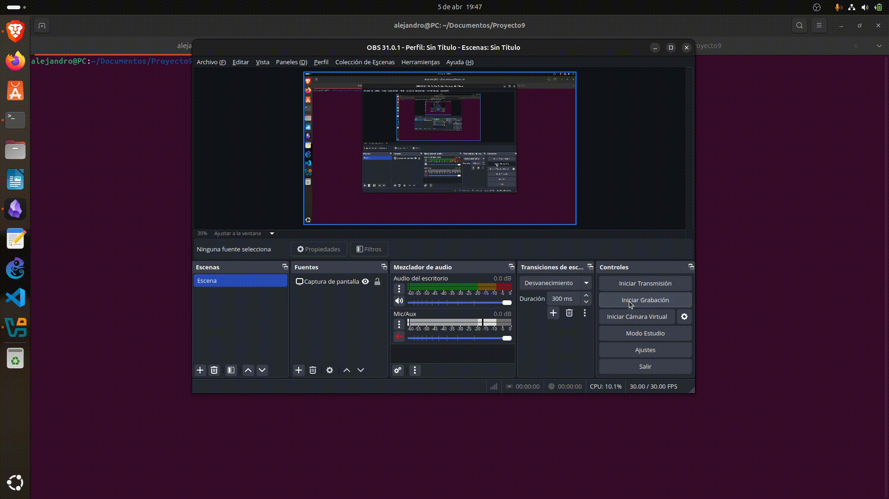

# Proyecto 9 bastionado

Se ha realizado la vía realista, utilizando una instancia EC2 en AWS y un dominio de No-IP (`securebastionado.zapto.org`)
## Parte 1

## Parte 2

En esta parte se configuró un Apache2 con HTTPS con un certificado válido emitido por Let's Encrypt para el dominio `securebastionado.zapto.org`. Luego se comparó este certificado con el de  `mozilla.org`

Parte 2 : [parte2.md](parte2.md)

## Parte 3

Se ha utilizado SSL Labs para analizar el certificado del dominio propio y se han localizado tres sitios con certificados inválidos de diferente tipo:

- Certificado caducado: `https://expired-rsa-dv.ssl.com`
- Certificado autofirmado: `https://self-signed.badssl.com`
- Nombre común erróneo: `https://wrong.host.badssl.com`

Parte 3: [parte3.md](parte3.md)

## Autor

**Nombre:** Alejandro Díaz Barea
**Centro:** IES Rafael Alberti  
**Curso:** Ciberseguridad  
**Fecha:** 6 de Abril de 2025