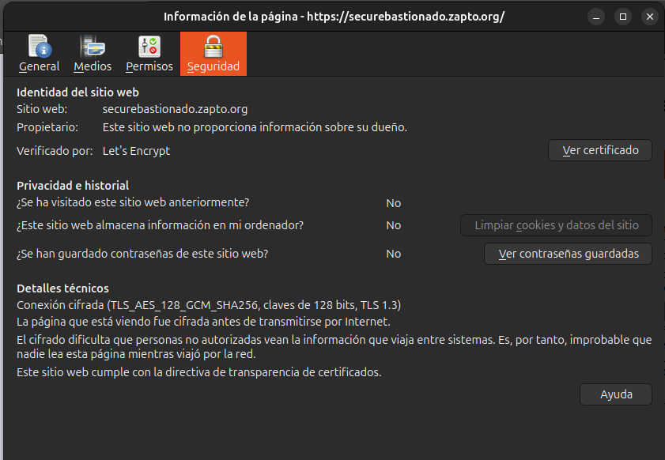
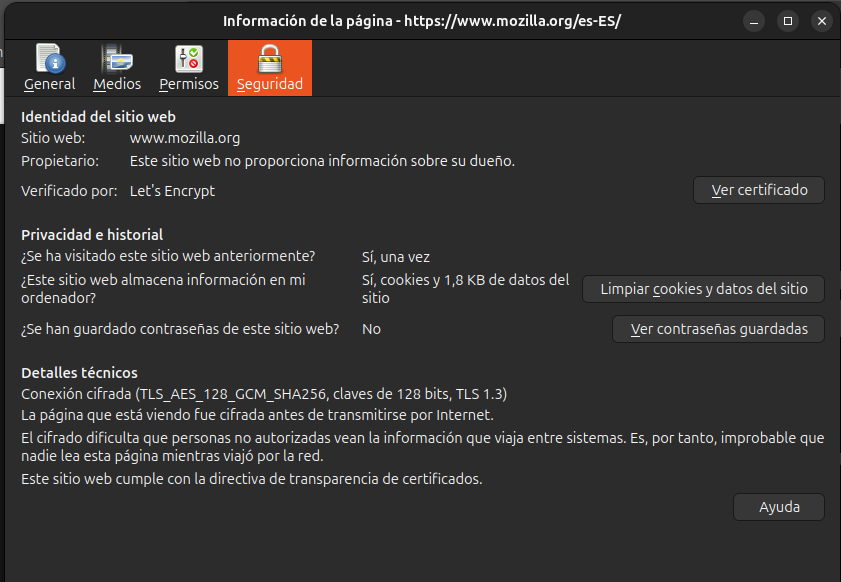

## Mi dominio: securebastionado.zapto.org

- Certificado emitido por: Let's Encrypt
- Cifrado: TLS 1.3
- Confianza: total (candado activo)
- Validación: DV (Domain Validation)

## Sitio verificado: mozilla.org

- Certificado emitido por: Let's Encrypt
- Cifrado: TLS 1.3
- Confianza: total (candado activo)
- Validación: DV también, aunque se trata de una organización reconocida

## Comparativa

| Aspecto                 | securebastionado.zapto.org | mozilla.org   |
| ----------------------- | -------------------------- | ------------- |
| Emisor                  | Let's Encrypt              | Let's Encrypt |
| Tipo de validación      | DV                         | DV            |
| HTTPS activo            | Sí                         | Sí            |
| Algoritmo de cifrado    | TLS 1.3                    | TLS 1.3       |
| Información del dueño   | No                         | No            |
| Confianza del navegador | Total                      | Total         |

Me llama la atención que Mozilla use un certificado DV en vez de OV (DV solo valida que el dominio te pertenece y OV verifica que tu orgnanización sea legítima). Esto nos dice que lo importante no es el tipo de certificado, sino la conexión cifrada y la confianza en la autoridad emisora.