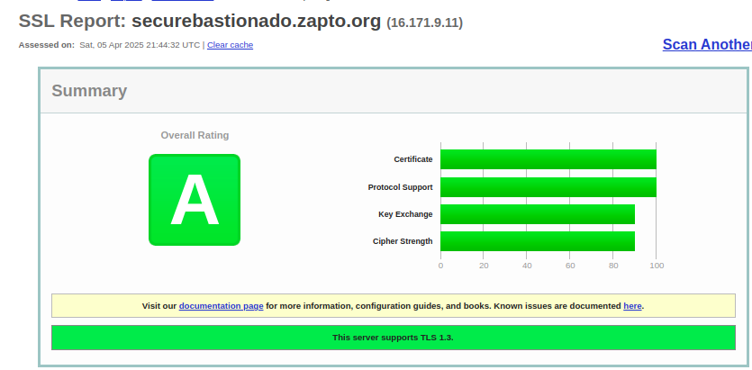
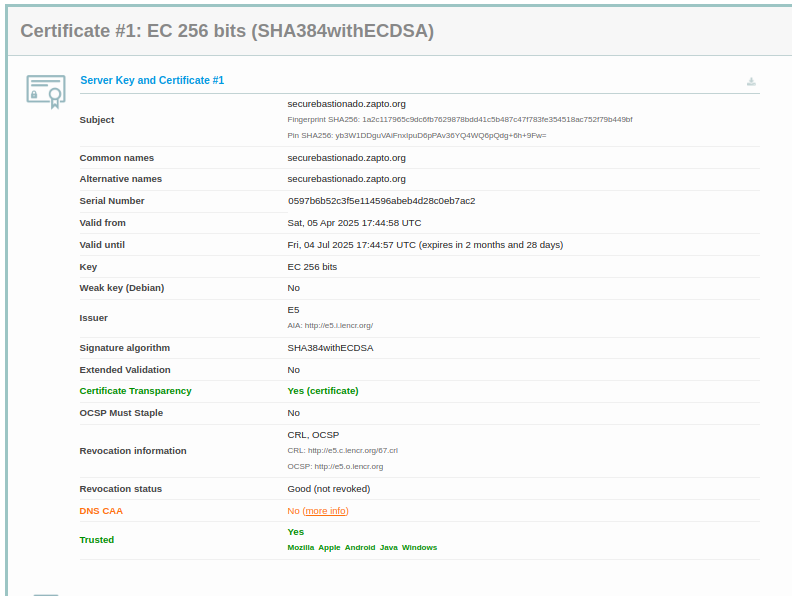
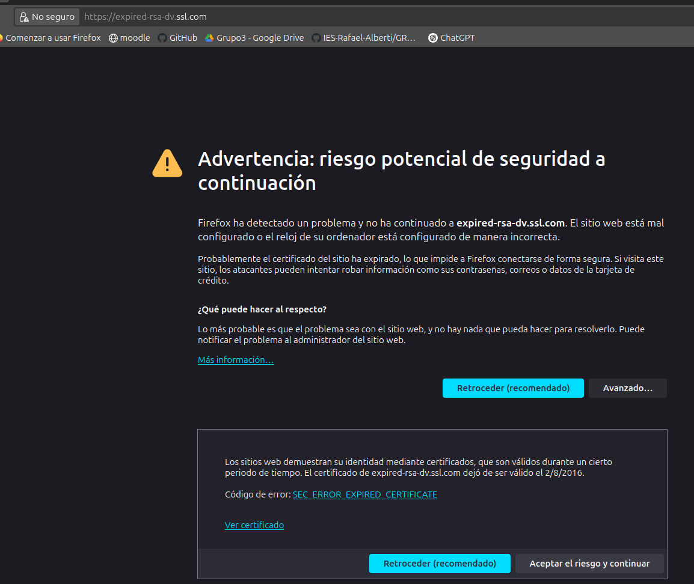
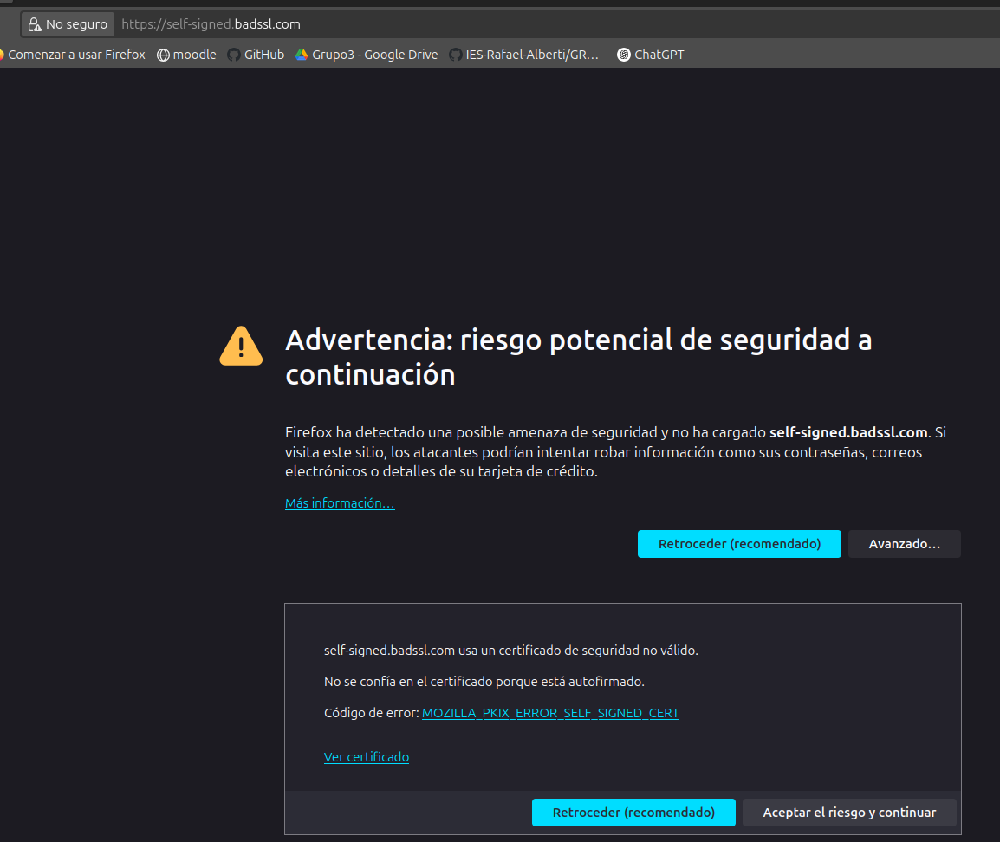
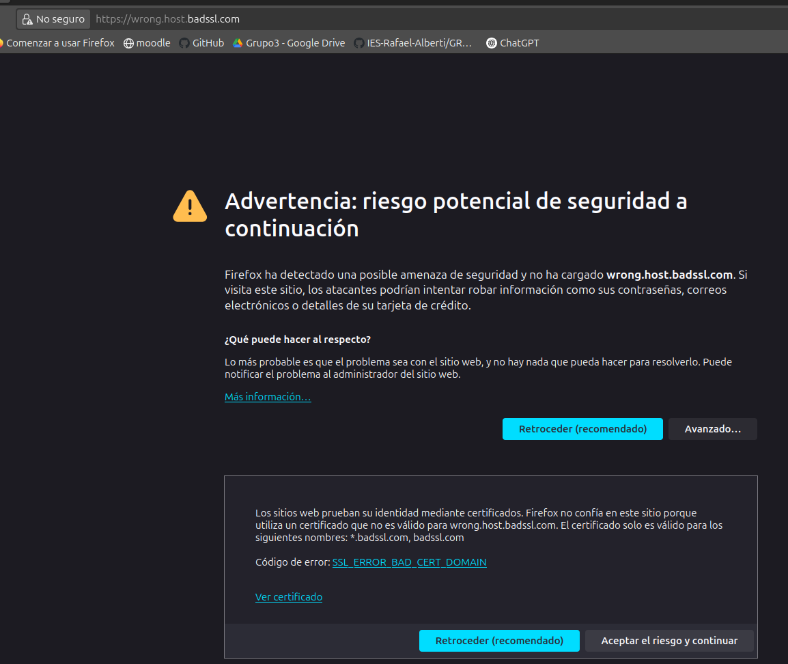

## Certificado válido

El certificado de `securebastionado.zapto.org`, que he analizado desde SSL Labs, ha recibido una A, lo que nos indica una configuración segura. Emitido por Let's Encrypt, una autoridad de certificación reconocida por la mayoría de navegadores, y cubre el dominio mediante los campos "Common Name" y "SAN". El certificado utiliza una de firma (SHA384withECDSA) y una clave pública EC de 256 bits, lo cual nos dice que da un nivel de cifrado robusto. Además, el servidor solo permite conexiones seguras mediante TLS 1.2 y 1.3, para que no aparezcan protocolos como SSL o TLS 1.0. También implementa Forward Secrecy y no tiene vulnerabilidades como Heartbleed, POODLE o ROBOT. Con estos datos estaríamos  seguros de que la web está protegida para subirla a producción

**Reporte :** https://www.ssllabs.com/ssltest/analyze.html?d=securebastionado.zapto.org

## Certificados inválidos

Se van a analizar 3 certificados mostrando las alertas que genera el ordenador y su descripción

### Certificado caducado – `https://expired-rsa-dv.ssl.com`

Este sitio da un certificado que ha superado su  validez. Al entrar, lanza el error `SEC_ERROR_EXPIRED_CERTIFICATE`, que nos indica que el certificado ha expirado y ya no da una conexión segura. Aunque el certificado fue emitido por una CA reconocida, su fecha ha terminado, por lo que pierde su validez, afectando la confianza del usuario y el navegador. Esto es por una mala renovación por parte del administrador del sitio web.

### Certificado autofirmado – `https://self-signed.badssl.com`

Este sitio utiliza un certificado SSL que ha sido autofirmado, es decir, generado por el propio servidor sin el respaldo de una Certificación externa. Nos da el error `MOZILLA_PKIX_ERROR_SELF_SIGNED_CERT`, que indica que no puede confiar en el emisor. Este tipo de certificados se usan en entornos de pruebas, pero no para producción, ya que no hay forma de verificar la identidad.

### Nombre común no coincide – `https://wrong.host.badssl.com`

Este certificado está emitido para un dominio distinto al que se está accediendo. El navegador detecta que el nombre común (CN) del certificado no coinciden con la URL, y da el error `SSL_ERROR_BAD_CERT_DOMAIN`. Este fallo se da por una mala configuración del servidor o por intentar usar el mismo certificado para varios dominios sin incluirlos en los campos correspondientes. Es un riesgo porque podría ocultar ataques de suplantación de identidad (spoofing).
