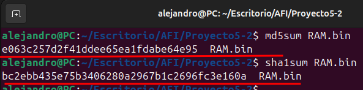
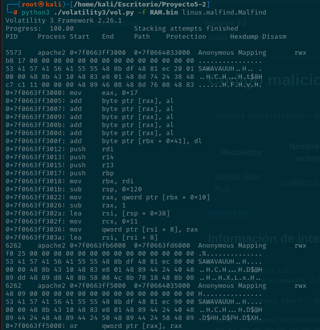
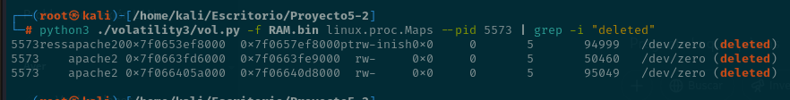
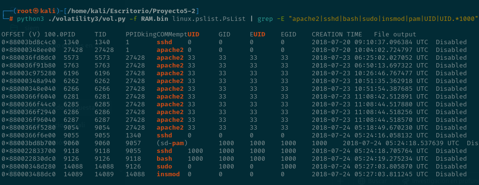
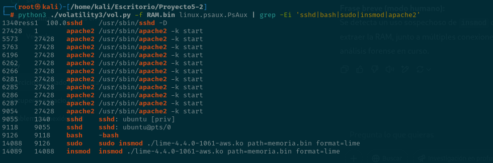
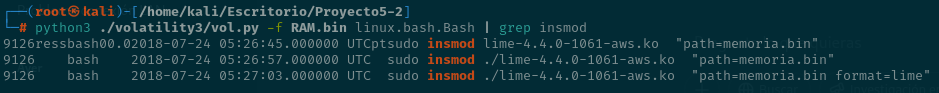
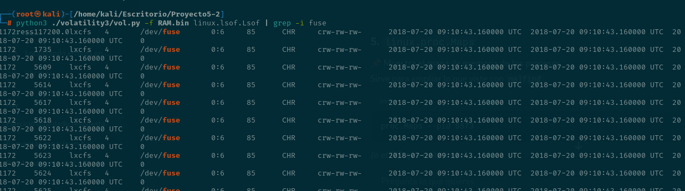
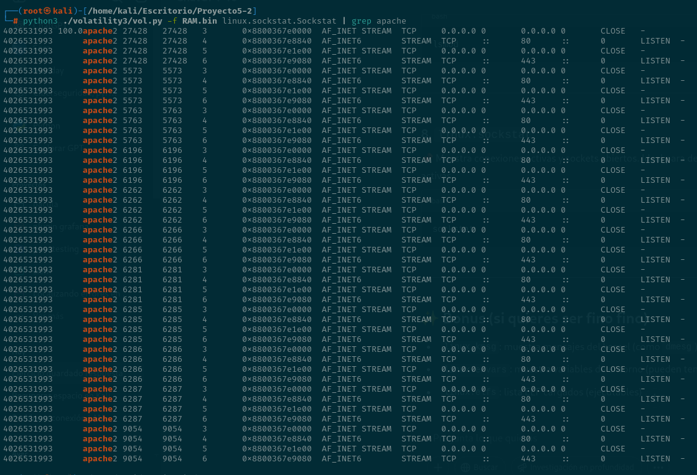

# Proyecto 6

## Calculo de hash

Los hashes del archivo están correctos

## Archivos corruptos inyectados

Se ha encontrado actividad en procesos de `apache2`, que tienen zonas de memoria ejecutable no asociadas a ningún archivo. Esto nos dice que alguien pudo haber inyectado código malicioso en memoria

Se puede ver el archivo completo [aquí](malfind.txt)

Hay memoria usada por Apache que apunta a archivos eliminados (`/dev/zero (deleted)`), lo que sugiere posible código malicioso cargado y oculto.

## Procesos

Hay indicios sospechosos como múltiples procesos `apache2` con memoria ejecutable, uso de `insmod` vía `sudo` y sesiones `sshd` que podrían indicar acceso remoto no autorizado.

Para más información revisar [aquí](pslist.txt)

Se detecta un uso sospechoso de `insmod` con permisos elevados para cargar un módulo que permite extraer la RAM, junto a múltiples conexiones SSH y procesos web, lo que sugiere una posible intrusión en curso.

Para más información revisar [aquí](psaux.txt)

## Historial de bash

insmod se utiliza para insertar módulos en el kernel

Para más información revisar [aquí](bash.txt)

## Uso de montajes

`lxcfs` accede a `/dev/fuse`, lo que puede indicar uso de contenedores o montajes personalizados, potencialmente sospechoso si no estaba previsto.

Para más información revisar [aquí](lsof.txt)

## Accesos por ssh a apache

El proceso `apache2` tiene una conexión abierta al puerto SSH (22), algo raro, ya que Apache no debería gestionar conexiones SSH. Puede indicar **túnel malicioso**, **pivoting** o **code injection**.

Para más información revisar [aquí](sockstat.txt)

## Cronología por secuencia lógica de eventos

| etapa | evento |
|-------|--------|
| 1     | despliegue de apache, php y wordpress |
| 2     | configuración de apache y certificados SSL |
| 3     | conexiones a base de datos remota en AWS |
| 4     | descarga y carga del módulo LiME con root |
| 5     | procesos apache2 con memoria maliciosa |
| 6     | conexión de apache2 al puerto SSH (22) |
| 7     | actividad sshd sospechosa en paralelo |
## Conclusión

El servidor fue comprometido tras configurar apache2. Se cargó un módulo para volcar la RAM, se detectó código malicioso en memoria y un posible túnel SSH a través de apache2, lo que sugiere una intrusión con persistencia y extracción de información.