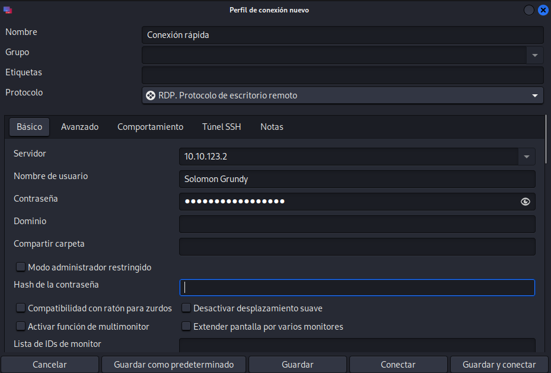

# Anthem (thm)

Para empezar vemos que no se puede hacer ping, por lo debe de haber un firewall que lo prohiba. Vamos a poner en nmap `-Pn` para que ignore el ping y de por echo que existe el servidor

Luego he dejado un fuzeo con gobuster de los direcotrios que nos da lo siguiente

En el `/robots.txt` hay una potencial contraseña 

El cms obviamente es `umbraco`

El dominio es `Anthem.com`

Buscando el usuario me he encontrado una flag que igual nos sirve para despues.

Tambien me he encontrado otra flag en /authors

He buscado el poema que le dedican al admin en google y pone que es de `Solomon Grundy`

En el primer blog pone `JD@anthem.com` pero ese parece que no es el correo del admin. Pero imagino que sera con ese dominio con las inicales en mayúsculas el correo del admin es `SG@anthem.com` ya que el de JD era Jane Doe

**Flag 1**
Inspeccionar en `/archive/we-are-hiring/`

**Flag 2**

Buscando thm en el inspeccionar en `/archive/we-are-hiring/` estaba esta

**Flag 3**

`/authors` que hemos encontrado antes

**Flag 4**

`/archive/a-cheers-to-our-it-department/` que tambien hemos visto antes

Como tenemos usuario y contraseña vamos a usar remmina para conectarnos en remoto 

Con el usuario Solomon Grundy no funciona pero con las inicales si 

Nada más iniciarla sale un user.txt

Si en esta ruta le cambiamos los permisos en propertis->secure podemos ver la contraseña

Una vez que tenemos la contraseña y sabemos que el suaurio es Administrator pues vamos a crear otra conexión para escalar privilegios

y tenemos el root.txt 

