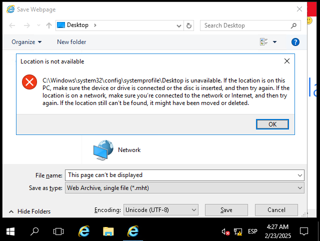

# Blaster (thm)

Al iniciar la máquina veo que no hace ping


Pero con este nmap si escanea los puertos

Lo que pasa es que`-Pn` en `nmap` le dice que asuma que el host está activo, incluso si no responde a el ping.
Esto nos ayuda cuando un firewall bloquea los paquetes de ping, pero los puertos siguen abiertos


Viendo que hay un servidor web abierto he entrado y el titulo es IIS Windows Server


Estoy haciendo un scaneo de directorios con  

``` 
gobuster dir -u http://10.10.117.59/ -w /usr/share/wordlists/dirbuster/directory-list-2.3-small.txt
```


Nos da que hay una redireccion en /retro

Cuando entrar en el direcotrio se puede ver que el creador es Wade por lo que es probable que haya un usuario con ese nombre


Mirando los comentarios veo que tenemos una posible contraseña a su usuario la cual es ```parzival```


Ya que tengo usuario y contraseña he usado `remmina` 


EN el user.txt encontramos la flag 


En favoritos del navegador se ve esto 

Que busco el CVE-2019-1388


Se ve que el usuario estaba buscando como explotar esta vulnerabilidad que justo se hace con el ejecutable que tiene que instalado como hhupd. 

La vulnerabilidad consiste en meterse en este ejecutable y darle a show details. Te saldra un enlace en Issued by. 


Le damos al enlace y lo vemos en el navegador

Le doy control + s y intentara guardarlo y saldra este error 


En la path hay que poner cmd 


Entrarás en un cmd con privilegios elevados 


La flag esta aqui 


Ahora vamos a probar con metasploit


El target PSH es el 2


Copiamos el payload que te da de powersheel y lo copiamos en la shell de la windows

Una vez puesto nos saldrá esto 


El comando es run persistence -X
