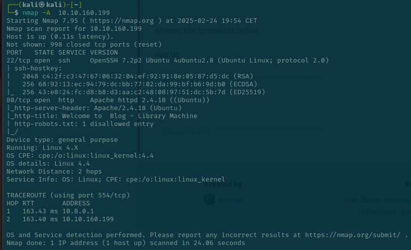

# Library (thm)

Empezamos con un nmap en el que sabemos que hay un puerto abierto de http y otro de ssh



He hecho un fuzeo con gobuster y solo me ha dado un direcotrio de imagenes que no vienen al caso


Se puede ver en el `/robots.txt` que dice de rockyou , esto es una librería de contraseñas para hacer fuerza bruta.


He visto antes en el nmap , hay un puerto de ssh abierto. Por lo que se me ha ocurrido buscando un usuario en la web, un ataque de fuerza bruta con la liberia rockyou y con el usuario que creo los post, cuyo nombre es `meliodas`


Vamos a hacer el ataque de fuerza bruta con hydra con :

```bash
 hydra -l <usuario> -P /usr/share/wordlists/rockyou.txt ssh://<IP>
```


La contraseña es `iloveyou1`


He visto que permisos tiene el usario despues de inicar por ssh y se ve que hay un script que se llama bak.py. Lo que hace es crear una copia de seguridad comprimida en formato ZIP del directorio /var/www/html.Recorre todos los archivos en ese directorio y los añade al archivo ZIP en /var/backups/website.zip. Esto hace backups automáticos del contenido web, pero también se puede usar como una vulnerabilidad si un atacante modifica el contenido del directorio de origen o inyectar código malicioso en el script.


He creado un archivo en el mismo directorio que se llama zipfile.py , lo cual si ejecutamos el script bak.py intente importar el módulo zipfile, en lugar de cargar el módulo legítimo del sistema, importará nuestro archivo malicioso

Este archivo ejecuta /bin/bash, lo que nos da una shell con los mismos privilegios con los que se ejecuta el script.

El comando `sudo usr/bin/python3 /home/meliodas/bak.py` hemos creado una reverse shell y somos administrador.


La flag de root esta aqui 

