# Basic pentesting (thm)

Empezamos un escaneo de puerto y vemos que hay samba, ssh y un par de servidores web

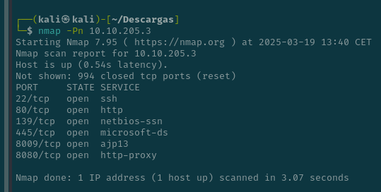

He hecho un fuzeo de los direcotrios del puerto 80

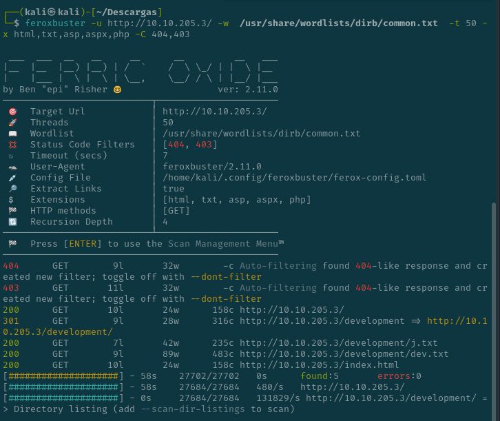

Hay un direcotrio con un par de archivos

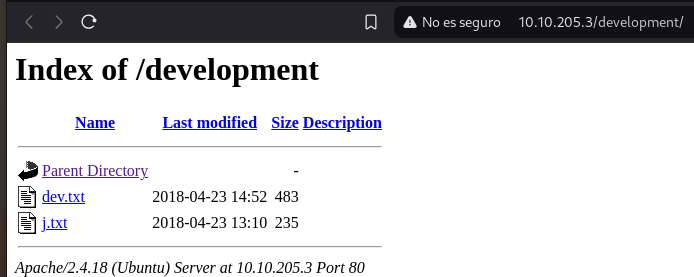

Voy a mirar en samba para ver que tiene

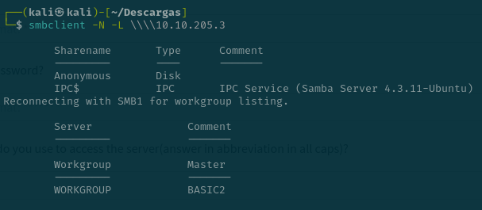

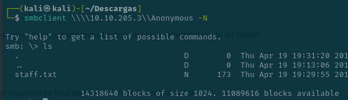

Intuyo que un usuario en Jan y otro es Kay

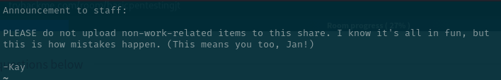

Como podemos ver aquí Jay tiene una contraseña insegura 

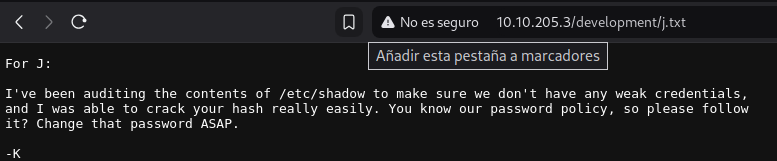

Por lo que vamos a hacer fuerza bruta a ssh

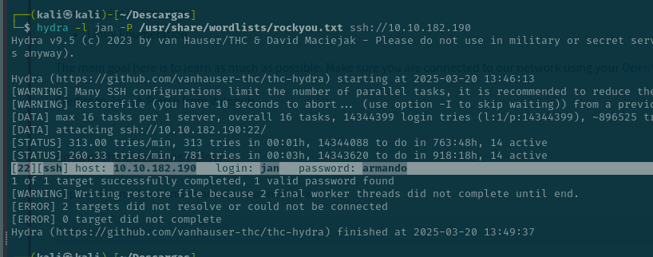

Su contraseña es "armando"

Esta la key del ssh de kay que parece tener privelgios de admin porque hace falta sudo para modificar sus cosas

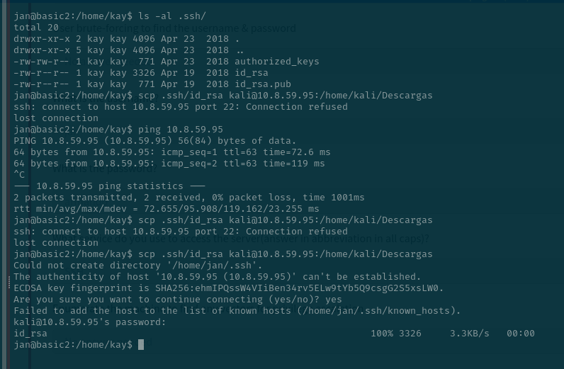

Rompemos la contraseña de la key

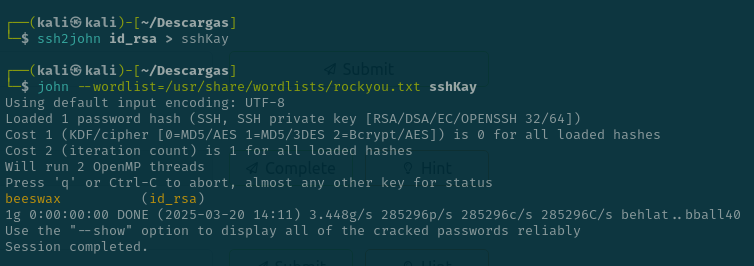

Ahora nos metemos con su key y con la contraseña que hemos sacado que era 'beeswax'

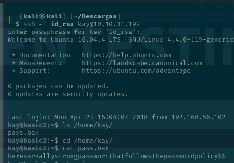

Ahora ya somos root y tenemos la contraseña de kay para serlos

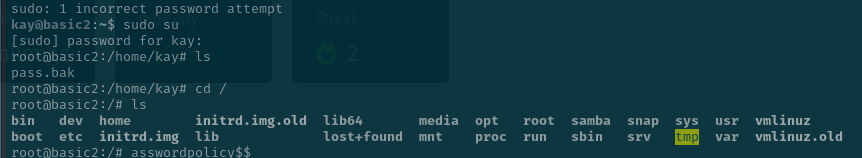