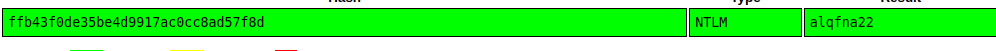

# Blue (thm)

## Task 1

**How many ports are open with a port number under 1000?**

Con el comando de ```nmap IP -p 1-1000``` podemos ver los puertos abiertos entre dos números que en este caso es del 1 al 1000.


**What is this machine vulnerable to? (Answer in the form of: ms??-???, ex: ms08-067)**

Con el comando ```nmap --script vuln IP``` se puede ver que pone ms17-010 el cual es un identificar de una vulnerabilidad


## Task 2

**Start metsploit**

msfconsole

**Find the exploitation code we will run against the machine. What is the full path of the code? (Ex: exploit/........)**

Para buscar la vulnerbailidad se hace con ```search ms17-010```


**Show options and set the one required value. What is the name of this value? (All caps for submission)**

Usamos 0 que es el id del exploit


Como vwmos en el show options hay que configar el RHOSTS, LHOST y payload

-> RHOSTS máquina victima
-> LHOST túnel vpn


run
## Task 3

**If you haven't already, background the previously gained shell (CTRL + Z). Research online how to convert a shell to meterpreter shell in metasploit. What is the name of the post module we will use? (Exact path, similar to the exploit we previously selected)**

Buscamos el shell_to_meterpreter


**Select this (use MODULE_PATH). Show options, what option are we required to change?**

Lo usamos y vemos en show options que hay que configurar el parámetro SESSION


**Set the required option, you may need to list all of the sessions to find your target here.**

Para saber que sesion poner usamos ```sessions -l``` para saber el id de este. 


Vamos que entra en una shell de windows y he ejecutado el comando ```whoami``` sabremos quien es el usuario


Ahora con el ps veremos los procesos


voy a coger el winLogon.exe con este pid 652


## Task 4

**Within our elevated meterpreter shell, run the command 'hashdump'. This will dump all of the passwords on the machine as long as we have the correct privileges to do so. What is the name of the non-default user?**


Se ve que el usuario es Jon y el hash hay que desencriptar la segunda parte


## Task 5

**Flag 1**

La primera la he encontrado en el directorio raíz


**Flag 2**

La segunda estaba en el directorio donde se encuentran las contraseñas en windwos

```C:\Windows\system32\config```


**Flag 3**

La última estaba en el directorio Documents del usuario Jon


