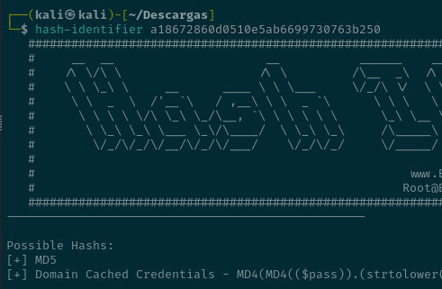
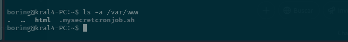

# Easy peasy (thm)

Empezamos con un escaneo de puertos y vemos que tiene un http nginx con la version 1.16.1

**NGINX**

Vamos a revisar ruta por ruta para buscar la flag.

- `/robots.txt`

    Parece que no hay nada

- `/index.html`

    Página por defecto de nginx

- `/hidden`

    Parece que aquí no hay nada por lo que voy a fuzear ese directorio

Parece que tenemos otro directorio y el index.html que ya hemos visto

- `/whatever`

    Aquí si se puede ver una flag en base64

Parece que ese era el último directorio 

**APACHE**

Vamos a revisar las rutas para la flag tambien

- `/index.html`
    
    Se puede ver la página por defecto de apache pero tiene una flag, esta es la flag 3

    Tambien tiene otra

  
    Está codificado en base62 y es un directorio escondido `/n0th1ng3ls3m4tt3r`

- `/robots.txt`

    Parece que tenemos un hash md5

    No he conseguido romper el hash pero una página web si. Aquí se puede ver la flag 2

- `/n0th1ng3ls3m4tt3r/`

    Se puede ver una cadena de texto que vamos a ver que tipo de hash es

    Es un sha-256

    La contraseña es `mypasswordforthatjob`

    Hay una imagen 

Nos da una contraseña y un usuario . La contraseña de binario y la contraseña es `iconvertedmypasswordtobinary`

Nos conectamos por ssh

Pone que esta rotado

La rotamos así

Hacemos una reverse shell en ese archivo 

Ya somos root 

