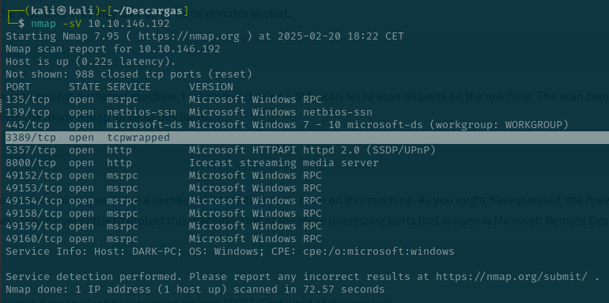
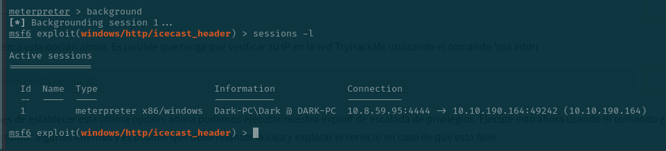
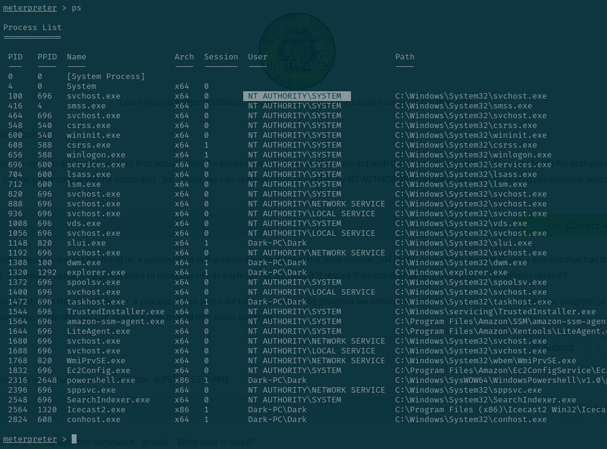

# Ice (thm)


## Task 2

Servicio de Microsoft Remote Desktop, es el 3389



El servicio del puerto 8000 es Icecast 


El hostname


## Task 3


Viendo que el cve es CVE-2004-1561 que lo he encontrado buscando el vendor Icecast, y su impacto es de 6.4


Buscamos en ```msfconsole```el exploit 


Configuro las variables y empiezo el exploit (run) para entrar en el meterpreter


## Task 4

viendo los procesos el usuario que los esta ejecutando es ```DARK```


con el comanodo sysinfo se puede ver la build y tambien se ve la Architecture


Viendo que la pista nos dice que debe de incluir ```eventvwr``` pues he escodigo el segundo path 


ahora que conocemos el exploit vamos a salir un momento con background y vemos las sesiones




Ahora ejecutamos el exploit y vemos que pide la session donde pondremos el numeor 1 que nos dio antes como id en las sesiones

Tambien hay que configurar el LHOST que como vemos esta mal puesto tiene que ser el de el tunel VPN de thm


Ahora comprobamos los privielgios y vemos que somos root

We can now verify that we have expanded permissions using the command `getprivs`. What permission listed allows us to take ownership of files?

SeTakeOwnershipPrivilege


## Task 5

Haciendo ps vemos que somos root 


In order to interact with lsass we need to be 'living in' a process that is the same architecture as the lsass service (x64 in the case of this machine) and a process that has the same permissions as lsass. The printer spool service happens to meet our needs perfectly for this and it'll restart if we crash it! What's the name of the printer service?

Mentioned within this question is the term 'living in' a process. Often when we take over a running program we ultimately load another shared library into the program (a dll) which includes our malicious code. From this, we can spawn a new thread that hosts our shell.

spoolsv.exe


Migramos el proceso y vemos que usuario somos


Ahora para tener las credenciales, usamos ```load kiwi```  para pordemos usar ```creds_all```


Nos da todas las contraseñas , la de Dark-PC es ```Password01!```

## Task 6

comando dumpear contraseñas = hashdump
comando para ver la pantalla del usuario en tiempo real = screenshare
para grabar desde el micrófono del sistema = record_mic
comando para modificar marcas de tiempo de archivos =timestomp
crear un Golden Ticket con Mimikatz = golden_ticket_create

