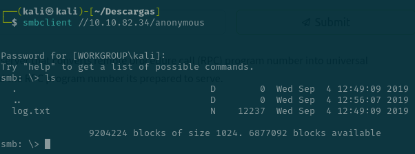
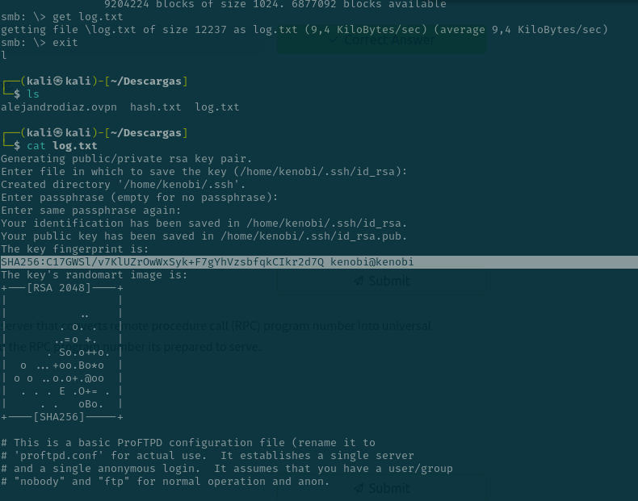

# Kenobi (thm)

Empezamos con un escaneo básico de los puertos


Con este nmap vemos que hay 3 carpetas compartidas de samba


POdemos logearnos como anonimo y hacer un ls y se ve un archivo que se llama log.txt

```bash
smbclient //10.10.82.34/anonymous
```



Se puede ver infromacion como



y el puerto es el 21 


El puerto 111 estaba abierto y thm nos explica que es un RPC y hay que usar este nmap 

```bash
nmap -p 111 --script=nfs-ls,nfs-statfs,nfs-showmount 10.10.82.34
```


Se ve que el mount esta en /var

Vemos aqui la version de FTP 


Tiene 4 exploits esta version


Obtener la versión de ProFTPd con netcat y ejecutar los comandos para copiar la clave privada 


Crear un direcotrio en nuestra máquina y montar el direcotrio en remoto 


Listar los archivos en `/var/tmp`


Descargar la clave privada a mi máquina


Conectarnos a kenobi por ssh


Flag


Buscando los tipos de archivos del sistema con el comando que dice thm , no se cual es el comando que no concuerda por lo que chatgpt me ha dicho que el que no cuadra es el `menu` 


Estas son las opciones que trae


Se ponen estos comanods :


Somos root

La flag esta en /root/root.txt

