# Retro (thm)

Empezamos con el escaneo de puertos, donde se puede ver una web en el puerto 80

Ponemos `-Pn` porque no da ping a la máquina

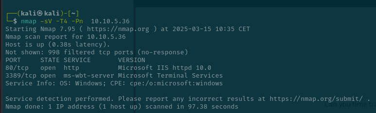

Estoy haciendo un scaneo de directorios con

`gobuster dir -u http://10.10.5.36/ -w /usr/share/wordlists/dirbuster/directory-list-2.3-small.txt`

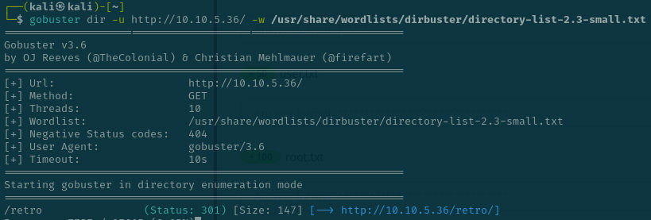

Nos da que hay una redireccion en /retro

Cuando entrar en el direcotrio se puede ver que el creador es Wade por lo que es probable que haya un usuario con ese nombre

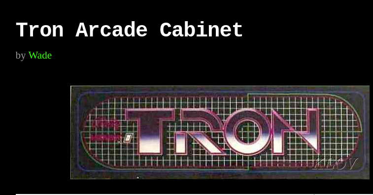

Mirando los comentarios veo que tenemos una posible contraseña a su usuario la cual es parzival

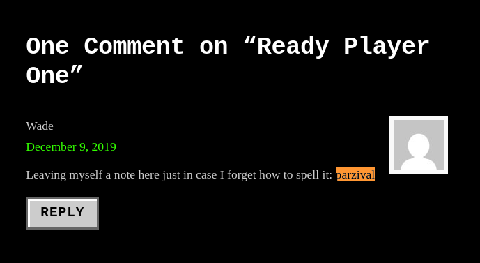

Ahora vamos a usar remmina para conectarnos a su máquina

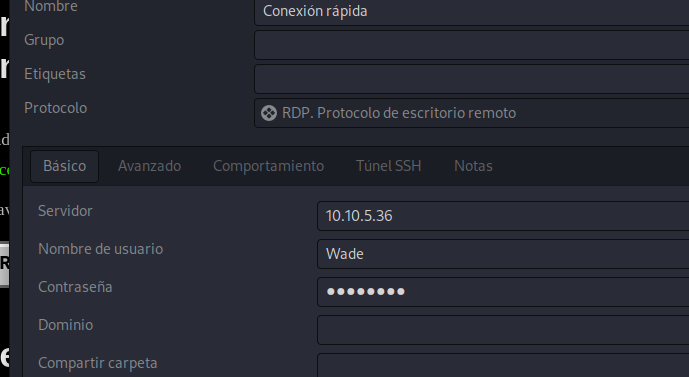

En el escritorio está el user.txt

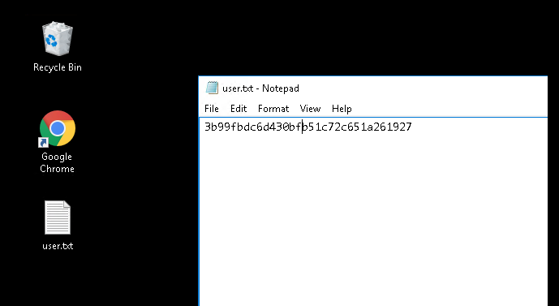

Para escalar privilegios al igual que la máquina blaster parece imposible. Por lo que   

Nos descargamos el zip del medio en https://github.com/SecWiki/windows-kernel-exploits/tree/master/CVE-2017-0213

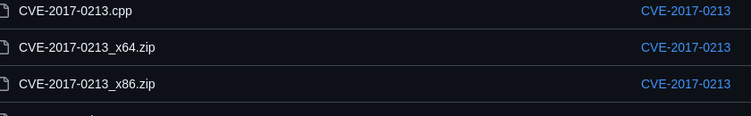

Lo descomprimo y abro un servidor web

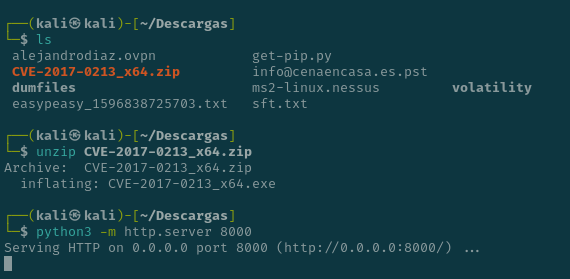

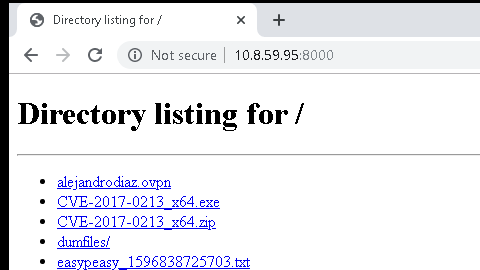

Nos lo descargamos en el windows

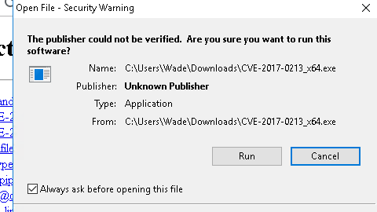

Ya somos root y tenemos la flag aquí

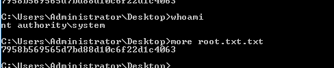