# techsupp0rt1 (thm)

Empezamos con un nmap de los puertos y parece que tenemos: ssh, servidor http, samba
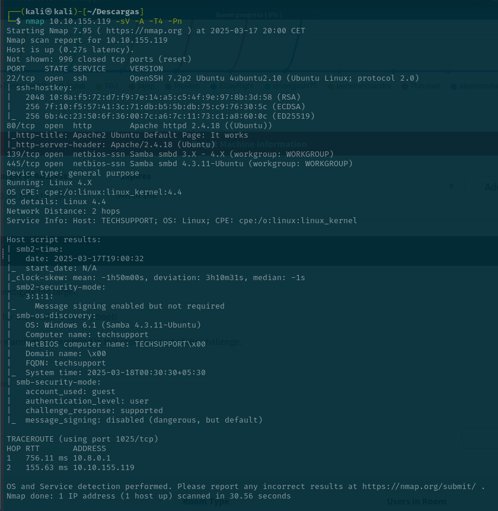

**Apache**

En el servidor apache está la página por defecto 

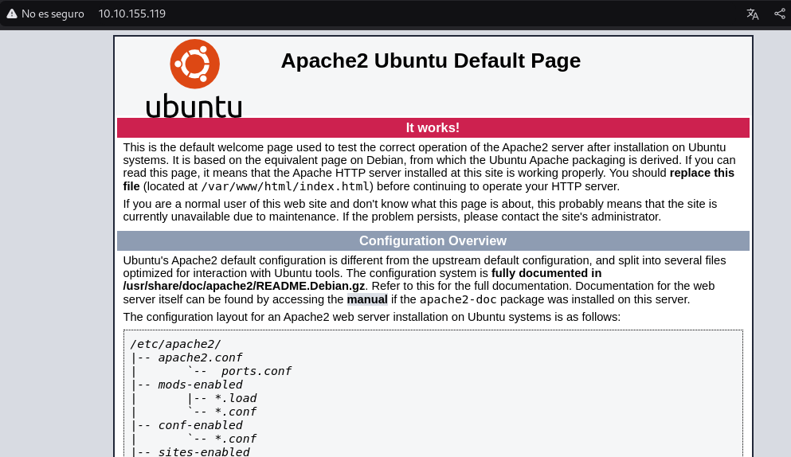

Tiene un directorio que es `test` y otro que es `wordpress`

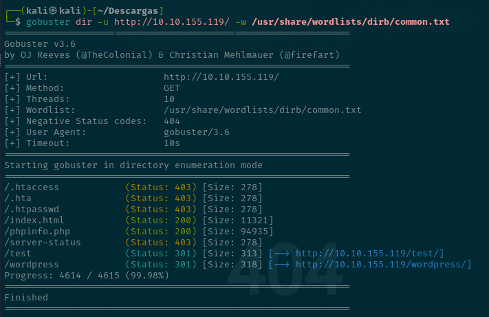

`/test`

Se puede ver un sitio con muchos avisos 

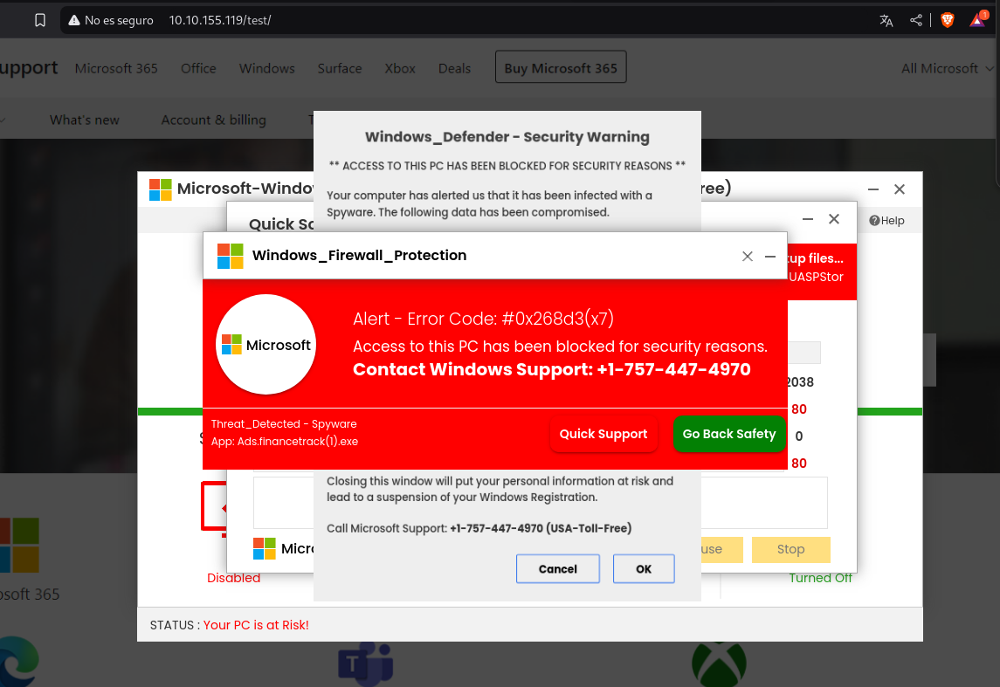

`/wordpress`

Se ve una página 

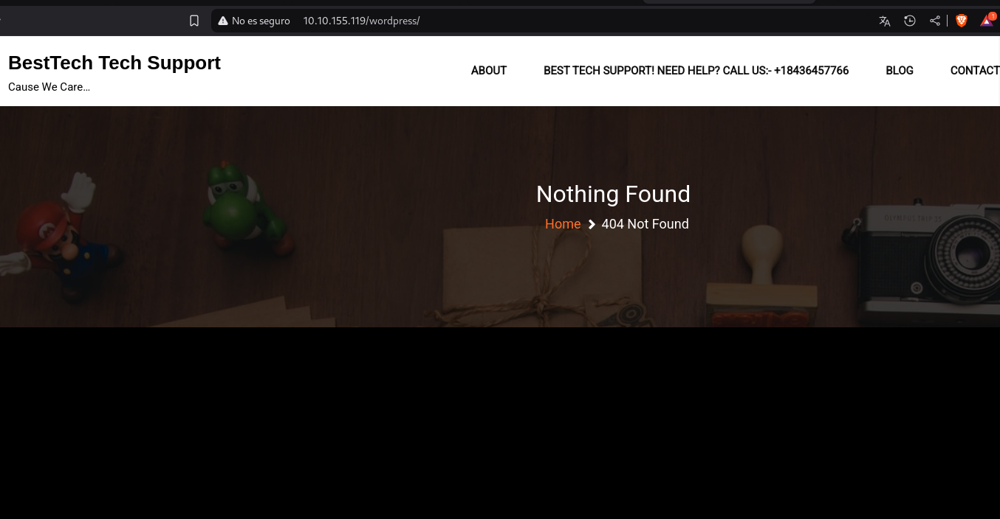

Tiene estos directorios

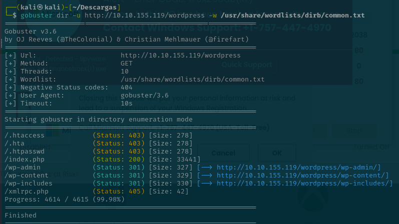

El más interesante es el `/wp-admin` y sale el tipico logeo en wordpress

**Samba**

En principio había empezado con el servidor apache pero como no encontré nada , voy a mirar lo primero de todo el samabclient y luego voy a la web

Se puede ver un direcotrio que se llama `websvr`
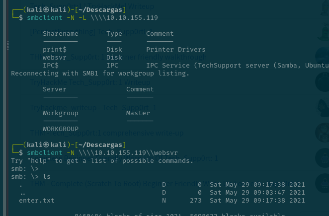

Vemos que hay un enter.txt y pone lo siguiente

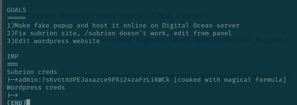

Parece que hay un directorio llamado `/subrion` y a parte da credenciales que parecen del wordpress

Pone que está hecha con la magia por lo que despues de buscar mucho , en cyberchef hay para decodificar por magic 

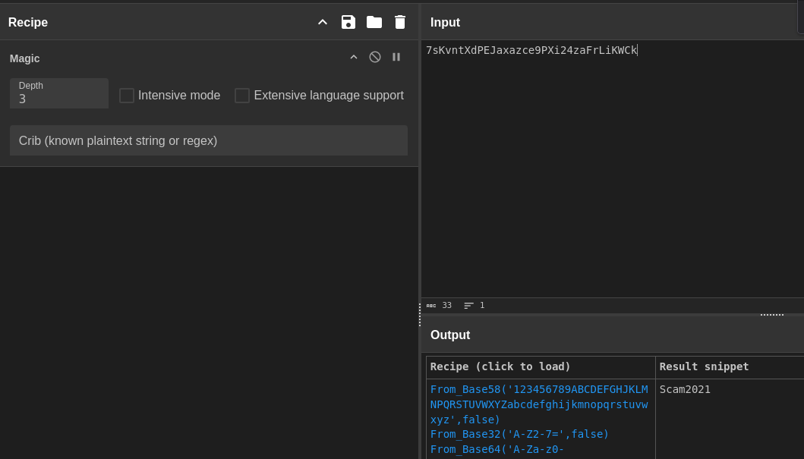

Se ve esto `Scam2021`

En /subrion no sale nada solo el robots.txt

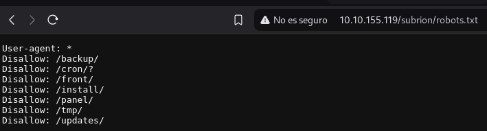

COn los datos de este he visto el /panel que tiene un login y nos vmaos a intentar logear con las credenciales de antes

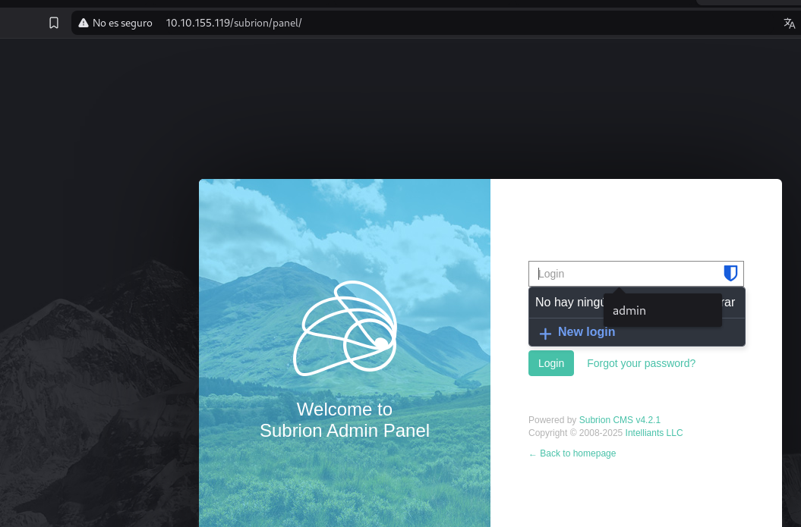

Me logeo y sale esto y tenemos que el cms es `Subrion CMS v 4.2.1`

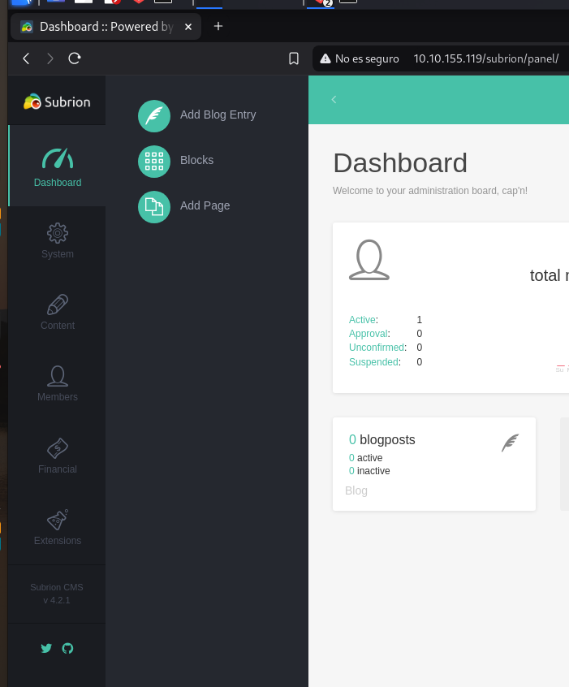

Buscamos su sploit
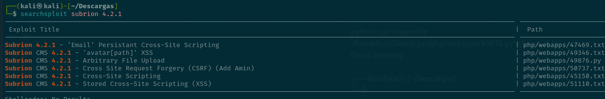

y lo explotamos

searchsploit -m php/webapps/49876.py

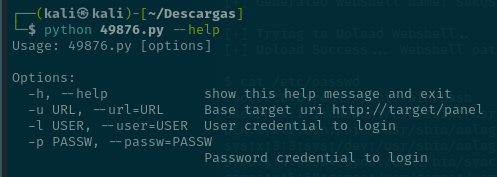

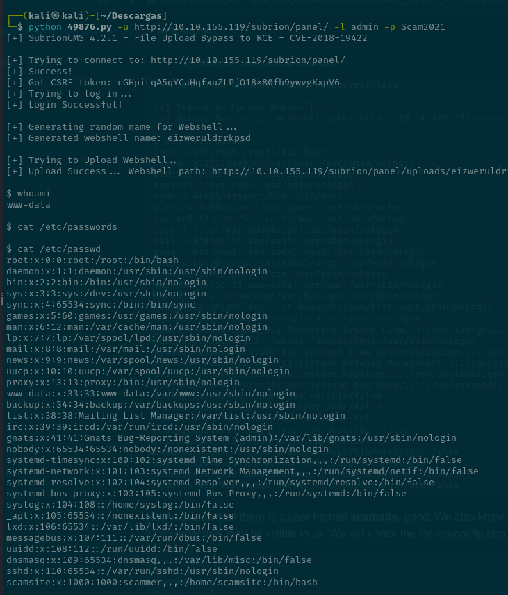

Se puede ver abajo que hay un suuario que se llama 

scamsite:x:1000:1000:scammer,,,:/home/scamsite:/bin/bash

Miramos en wordpress 

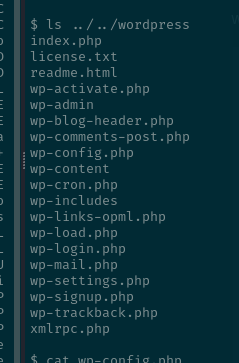

Se puede ver usuario y contraseña en el wp-config.php

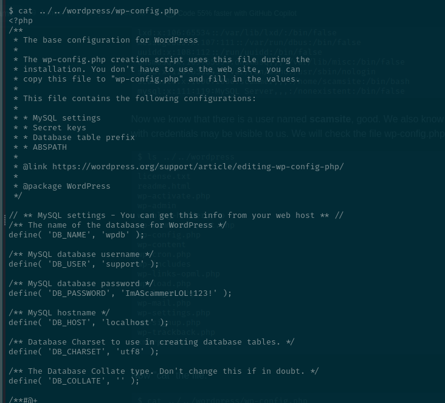

Voy a intentar loegarme con eso en wordpress

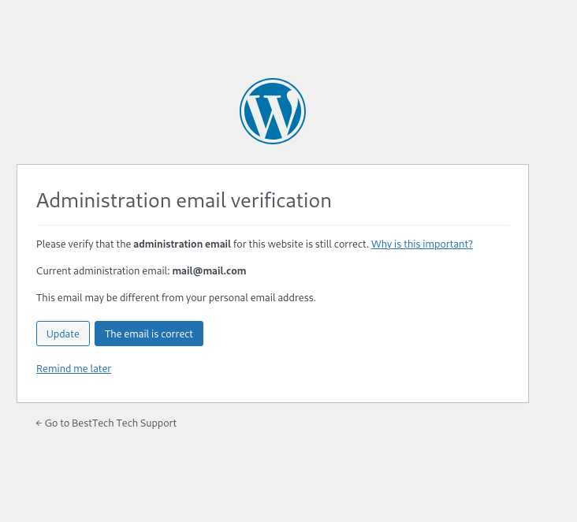

No te deja por lo que vamos a probar por ssh

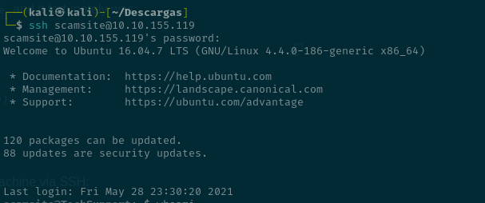

Con sudo -l se puede ver el payload y luego ejecutamos esto para ser root y ver la root.txt 

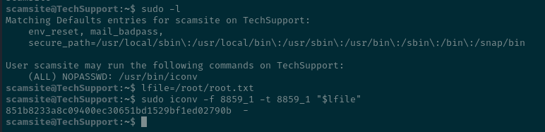